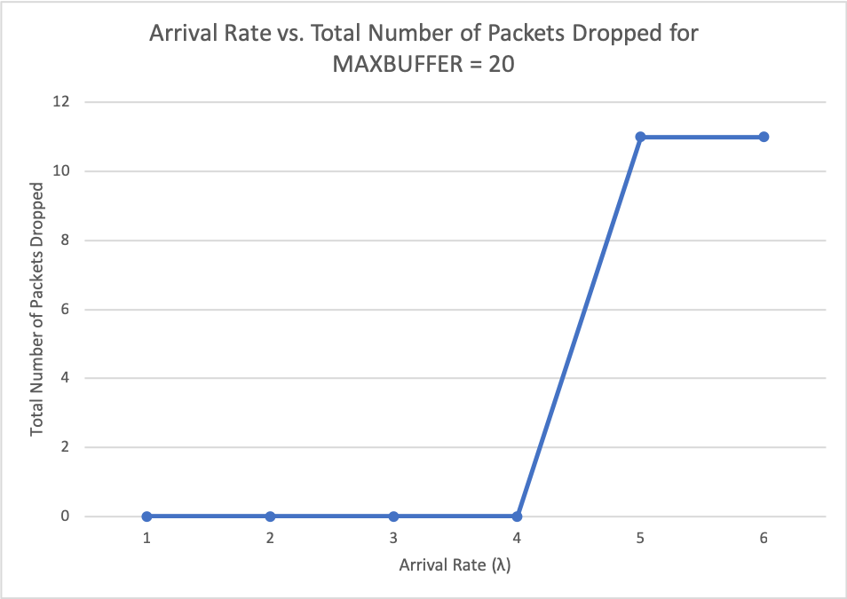
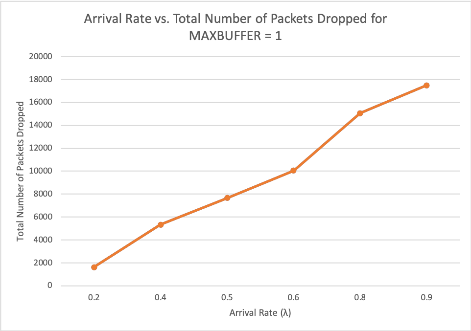

# ECS 152 Project 1 Write Up

Yara Fawaz 912243010

Armand Nasseri 912679383

Jennifer Nguyen 914995612

## **IMPLEMENTATION DETAILS**

Similar to Project 1, we utilized the GEL as a timeline for events that can happen. We have 3 types of events: arrival, departure, and backoff.

 Arrival and departure events push frames onto the host queue and pop frames off the host queue respectively. With a new arrival, we also generate a new arrival event for the gel. For departure event, we need to check if it is an acknowledge event or not. If it is an acknowledgement, the event it acknowledges is popped and if it has another frame in the queue, we create a new backoff for it. If it is not an acknowledgement, we have to create an acknowledgement frame at the host that's will receive the frame. (Note: In our code, we call frames packets, a remnant from Project 1.) Each time a frame departs, we increment `totalBytesTransmitted` by the size of the frame/acknowledgement. `totalBytesTransmitted` will be used to calculate the throughput. 

 Backoff events happen every 0.1 seconds. This event is utilized to decrement the backoff counters of all the hosts. The backoff event also handles creating a new backoff event for the next 0.1 second time increment. At each backoff event, we calculate the queue delay as well regardless whether or not the channel is busy.

## **Calculations**

 `Throughput = bytes in frame / total time` 

Throughput is calculated by the number of bytes in a frame sent successfully (including the acknowledgement) divided by the total amount of time. 

 `Average Network Delay = (queue delay + transmission delay) / throughput` 

The average network delay is the total delay (which is the queuing and transmission delay) divided by the throughput. 

## **RESULTS**

### Experiment 1: N = 10

### Experiment 2: N = 50

## **ANALYSIS**

For both experiments, we see a decrease in throughput when λ changes from 0.2 to 0.4. Our theory is that when λ is 0.4, the network starts experiencing backoffs and the throughput is no longer 100%. The graph increases afterwards because λ is higher meaning more frames arriving and a higher throughput.